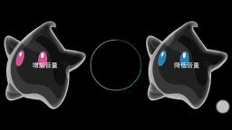

#### 效果图如下


---

#### 用到的知识点：
#####  渲染器的使用
```
(1)LinearGradient 线性渲染
      LinearGradient(float x0, float y0, float x1, float y1, int[] colors, float[] positions, Shader.TileMode);
     X0:    渐变起初点坐标x位置
     y0:    渐变起初点坐标y位置
     x1:    渐变终点坐标x位置
     y1:    渐变终点坐标y位置
     colors:  渐变颜色数组
     positions:这个也是一个数组用来指定颜色数组的相对位置 如果为null 就沿坡度线均匀分布
     tile：渲染模式(平铺方式)

     LinearGradient shader = new LinearGradient(0, 0, endX, endY, new int[]{startColor, midleColor, endColor},new float[]{0 , 0.5f, 1.0f}, TileMode.MIRROR);
     其中参数new int[]{startColor, midleColor, endColor}
     是参与渐变效果的颜色集合，
     其中参数new float[]{0 , 0.5f, 1.0f}是定义每个颜色处于的渐变相对位置，
     这个参数可以为null，如果为null表示所有的颜色按顺序均匀的分布
 ```
 ```
 (2)(2)梯形渲染器

     //创建梯形渲染对象
    int mColorSweep[] = {Color.GREEN, Color.RED, Color.BLUE, Color.YELLOW, Color.GREEN};
    mSweepGradient = new SweepGradient(540, 750, mColorSweep, null);
    第一个参数是说你要 从x轴的什么位置开始渐变， 第二个是y轴 ，
    第三个是渐变颜数组，
    第四个是位置，可以指定渐变的绝对位置

    SweepGradient gradient = new SweepGradient(getMeasuredWidth() / 2, getMeasuredHeight() / 2, mRunPaintColor, null);
           mPaintRun.setShader(gradient);

````